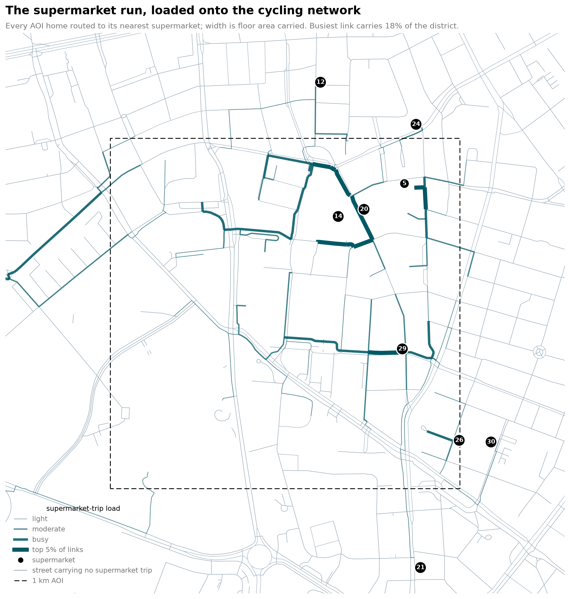

# GIS-Urban-Analyses

Network analyses of urban accessibility, built on OpenStreetMap with OSMnx, GeoPandas and
NetworkX. Each study takes a real planning question, answers it on the actual street
network rather than on straight-line distance, and reports the number a decision needs.

Current study area: **~1 km² centred on Triangeln, Malmö** — geocoded from OSM rather
than hand-typed, so the square sits on the place and not on a guessed coordinate.

---

## 1. Cycling fragmentation and missing links

**The question:** Malmö's protected cycling network looks continuous on a map. Is it?

Protected infrastructure only works if you can ride it end to end. A cycleway that stops
at a junction and resumes fifty metres later is two pieces of infrastructure, not one, and
a rider treats the gap as the whole route's weakest point. This analysis measures where
the network actually breaks and which short new links would knit it back together.

**Method.** Every edge is classified as *protected* (physically separated from motor
traffic), *painted lane* (in the carriageway) or *mixed traffic*, reading both the
`highway=cycleway` idiom and the `cycleway:left/right` tags-on-a-road idiom. The protected
edges form a subgraph, and its connected components are the islands of continuous riding.
Missing links come from a multi-source Dijkstra run with all protected edges removed, so
every candidate path crosses only unprotected street; components are absorbing, which
keeps each reported gap atomic — one hop between two islands. Each link scores as
`rescued_km / gap_length × 100`, and union-find resolves the ranking into a build order so
a second link between two already-joined islands is never counted twice.

**What it found.** 8.37 km of protected network inside the square, broken into **19
disconnected components**. Only 51.6% of it — 4.32 km — sits in the largest piece; the
remaining 4.05 km is stranded across 18 fragments. Against that, **18 links totalling
1,231 m of new infrastructure would reduce all 19 components to one.** The top-ranked link
is 35 m long and rescues 0.47 km of stranded network.


---

## 2. Nearest-facility and closest-facility allocation

**The question:** how far is every home from its nearest school and supermarket by bike,
and which streets carry the resulting trips?

Two different questions, deliberately kept apart. *Nearest-facility* asks how long the
ride is. *Closest-facility allocation* asks which facility each home actually belongs to,
which partitions the district into catchments and reveals how unevenly demand falls across
sites. Demand is weighted by residential floor area rather than counted per building, so a
tower and a townhouse are not one vote each.

**Method.** Facilities are pulled from OSM and resolved into distinct *sites* — polygons
are never merged on distance, since neighbouring schools often share a fence, while a shop
node inside its own retail building is absorbed into it, and a shared name only merges two
clusters when they are close enough not to be two branches of a chain. Routing runs on a
comfort-weighted impedance at 15 km/h, where mixed traffic costs 1.45× its true length and
a painted lane 1.15×, so the model prefers the route a rider would actually pick over the
shortest one. Trip load is then accumulated edge by edge along every home's route to its
allocated site.

**What it found.** 34 school sites and 31 supermarket sites resolved from 71 OSM features;
336 buildings in the square give 249 residential demand points carrying 786,254 m² of
floor area. Median ride is **1.0 minutes to either tier** — 99.9% of floor area is within
5 minutes of a school, 99.6% within 4 minutes of a supermarket. The interesting result is
in the load: **protected infrastructure carries 38.9% of all supermarket trips while making
up only 30.2% of the network**, a 1.29× over-representation, which says riders concentrate
onto separated paths wherever they exist. The busiest single link carries 18% of the whole
district's supermarket demand. Comfort weighting changes which supermarket 5.8% of the
floor area is assigned to, for a mean detour of just 0.02 minutes — a near-free
improvement in route quality.



---

## Layout

```
malmo-network-analysis/
  IN/     design-token source and the reference notebook this work grew out of
  WORK/   the two analysis notebooks
  OUT/    generated results - gitignored, except the two figures above
```

Both notebooks carry their own colour validation: the White Arkitekter palette is checked
for OKLCH lightness and chroma, pairwise ΔE separation under simulated protanopia and
deuteranopia, and contrast on white, with the reasoning for every deviation from the raw
brand hexes recorded in the notebook rather than asserted.

See [malmo-network-analysis/README.md](malmo-network-analysis/README.md) for method
detail, outputs and how to run them.

## Caveats

- **Edge effects.** A 1 km² window truncates the network. A component that looks stranded
  here may continue outside the frame; the method is scale-independent, the numbers are not.
- **OSM completeness.** A missing `cycleway:*` tag reads as mixed traffic and will invent a
  gap. Spot-check top-ranked links against aerial imagery.
- **Topological vs. legal continuity.** Two protected ways meeting at a node count as
  connected even where the real movement requires dismounting or crossing.
